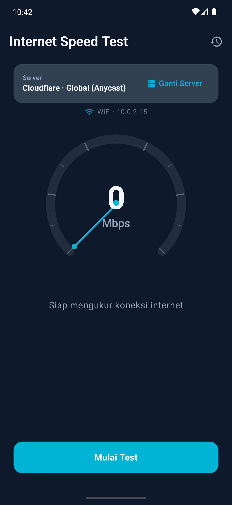
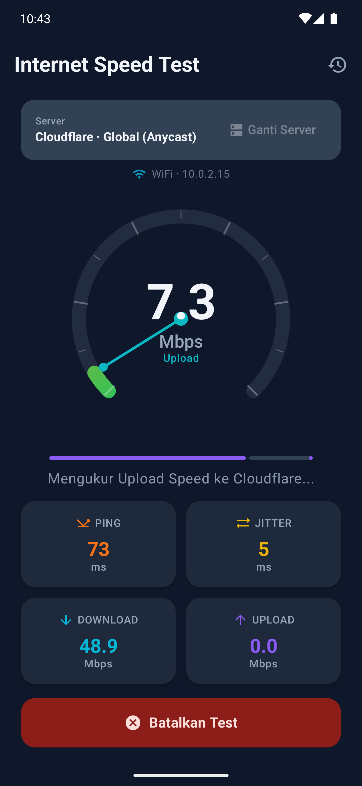
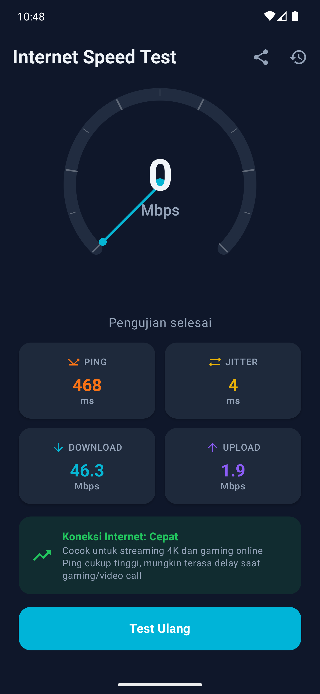
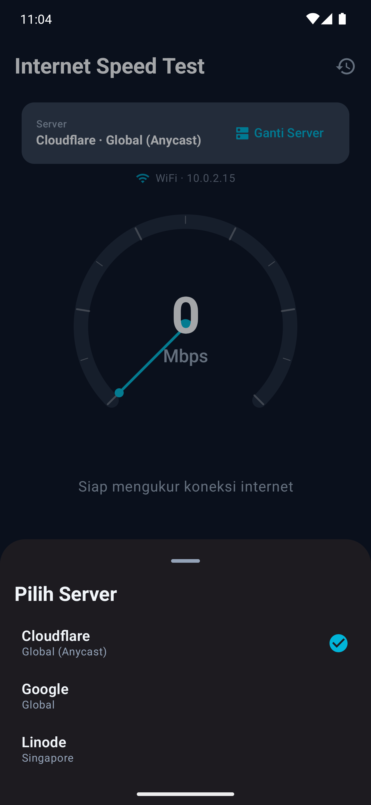
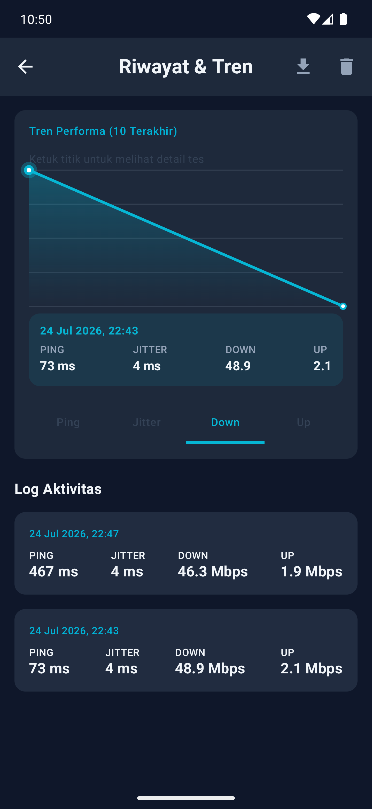
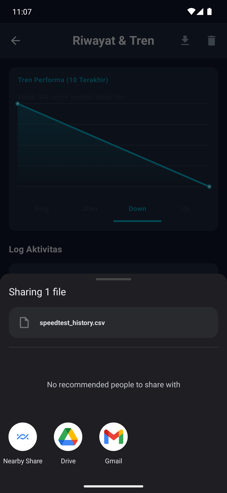
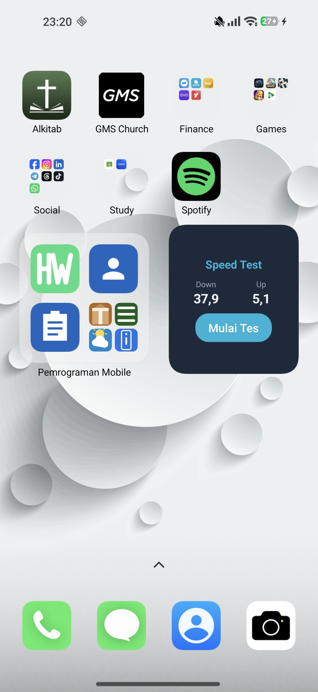

# 🌐 Android Internet Speed Test

**Aplikasi pengukuran performa koneksi internet** — Ping, Jitter, Download Speed, dan Upload Speed — dibangun dengan **Jetpack Compose**, **Material 3**, **Room Database**, dan arsitektur **MVVM**.

> **Mata Kuliah:** Pemrograman Mobile Android — Semester 6
> **Tech Stack:** Kotlin • Jetpack Compose • Material 3 • Coroutines/Flow • MVVM • Room • Glance (App Widget)

---

## 👤 Identitas Mahasiswa

| Keterangan | Detail |
|---|---|
| **Nama** | Willy Rafael F. Silalahi |
| **NIM** | 23083000168 |
| **Kelas** | 6A2 |
| **Mata Kuliah** | Pemrograman Mobile |
| **Instansi** | Universitas Merdeka Malang |

---

## Daftar Isi

1. [Gambaran Umum](#gambaran-umum)
2. [Screenshot Fitur](#screenshot-fitur)
3. [Arsitektur & Struktur Project](#arsitektur--struktur-project)
4. [Prasyarat](#-prasyarat)
5. [Panduan Setup](#panduan-setup)
6. [Penjelasan Komponen Utama](#-penjelasan-komponen-utama)
7. [Cara Kerja Pengukuran](#cara-kerja-pengukuran)
8. [Customization & Pengembangan Lanjutan](#-customization--pengembangan-lanjutan)
9. [Troubleshooting](#-troubleshooting)
10. [Lisensi](#-lisensi)

---

## Gambaran Umum

Aplikasi ini mengukur empat parameter koneksi internet ke server pilihan user:

| Parameter | Metode | Keterangan |
|-----------|--------|------------|
| **Ping (Latency)** | ICMP ping via `Runtime.exec()` | Rata-rata RTT dari 5 paket |
| **Jitter** | Selisih RTT antar paket berurutan | Ditampilkan sebagai fase tersendiri setelah Ping |
| **Download Speed** | HTTP GET stream dari server pilihan | Maks. ~15 MB data test |
| **Upload Speed** | HTTP POST dummy bytes | ~5 MB payload |

### Fitur Utama

- ✅ **Circular Speedometer Gauge** — custom Canvas Compose dengan animasi smooth, jarum turun ke 0 di setiap pergantian fase (Ping → Jitter → Download → Upload)
- ✅ **Batalkan Test** — tombol "Batalkan Test" muncul selama pengujian berjalan, langsung menghentikan test dan menutup koneksi yang masih berjalan
- ✅ **Pilihan Server** — Cloudflare (Global), Google (Global), dan Linode (Singapore); bisa diganti sebelum memulai test
- ✅ **Info Jaringan Real-time** — menampilkan tipe koneksi (WiFi/Seluler) dan alamat IP saat ini
- ✅ **Riwayat & Grafik Tren** — hasil test tersimpan di Room Database, ditampilkan sebagai grafik tren (Ping/Jitter/Download/Upload) dengan **titik yang bisa diketuk** untuk melihat detail riwayat test pada titik tersebut
- ✅ **Share & Export** — bagikan ringkasan hasil test sebagai teks, atau export seluruh riwayat ke file CSV
- ✅ **Home Screen Widget** — menampilkan hasil test terakhir langsung dari home screen, dengan tombol mulai test cepat
- ✅ **Material 3 Design** — mendukung Light & Dark theme secara otomatis

---

## Screenshot Fitur

> 📌 Screenshot di bawah diambil langsung dari emulator. Satu yang belum ada (Home Screen Widget) perlu ditambahkan manual ke folder [`screenshots/`](screenshots) — lihat `screenshots/README.md` untuk detail nama file yang masih kurang.

<table>
  <thead>
    <tr>
      <th>Fitur</th>
      <th>Screenshot</th>
      <th>Penjelasan</th>
    </tr>
  </thead>
  <tbody>
    <tr>
      <td>Layar Utama (Idle)</td>
      <td></td>
      <td>Tampilan awal aplikasi: gauge kecepatan, info jaringan, dan pilihan server sebelum test dimulai.</td>
    </tr>
    <tr>
      <td>Proses Pengujian</td>
      <td></td>
      <td>Gauge menampilkan angka real-time untuk fase Ping/Jitter/Download/Upload, lengkap dengan progress bar dan tombol Batalkan Test.</td>
    </tr>
    <tr>
      <td>Hasil Test</td>
      <td></td>
      <td>Ringkasan akhir berupa kartu Ping, Jitter, Download, dan Upload setelah pengujian selesai.</td>
    </tr>
    <tr>
      <td>Pilih Server</td>
      <td></td>
      <td>Bottom sheet untuk memilih server test: Cloudflare, Google, atau Linode (Singapore).</td>
    </tr>
    <tr>
      <td>Riwayat & Grafik Tren</td>
      <td></td>
      <td>Grafik tren 10 hasil test terakhir per parameter (Ping/Jitter/Down/Up); titik grafik bisa diketuk untuk melihat detail tes pada tanggal tersebut.</td>
    </tr>
    <tr>
      <td>Share & Export CSV</td>
      <td></td>
      <td>Bagikan hasil test sebagai teks atau export seluruh riwayat ke file CSV.</td>
    </tr>
    <tr>
      <td>Home Screen Widget</td>
      <td></td>
      <td>Widget menampilkan hasil Download/Upload terakhir beserta tombol untuk memulai test baru.</td>
    </tr>
  </tbody>
</table>

---

## Arsitektur & Struktur Project

Menggunakan pola **MVVM (Model-View-ViewModel)** dengan **Unidirectional Data Flow (UDF)**:

```
┌─────────────┐     ┌──────────────────┐     ┌───────────────────┐
│   UI Layer  │ ←── │   ViewModel      │ ←── │   Data Layer      │
│  (Compose)  │     │  (StateFlow)     │     │  (Manager + Room) │
│             │ ──→ │                  │ ──→ │                   │
│ Observe     │     │ Process events   │     │ Network I/O &     │
│ StateFlow   │     │ Update UiState   │     │ persistensi lokal │
└─────────────┘     └──────────────────┘     └───────────────────┘
     [Event]              [State]                  [Flow<T>]
```

### Struktur Folder

```
app/src/main/java/com/example/speedtest/
├── MainActivity.kt                          ← Entry point
├── data/
│   ├── SpeedTestManager.kt                  ← Logika network (Ping/Jitter/DL/UL)
│   ├── NetworkMonitor.kt                    ← Pemantauan tipe koneksi & IP real-time
│   └── local/
│       ├── AppDatabase.kt                   ← Setup Room Database
│       ├── dao/SpeedTestDao.kt              ← Query riwayat hasil test
│       └── entity/SpeedTestResult.kt        ← Entity hasil test (ping/jitter/down/up)
├── model/
│   └── SpeedTestModels.kt                   ← Data classes, TestPhase, & sealed classes
├── viewmodel/
│   └── SpeedTestViewModel.kt                ← State management & orkestrasi test
├── util/
│   └── ShareUtils.kt                        ← Share teks & export CSV
├── widget/
│   ├── SpeedTestWidget.kt                   ← Home screen widget (Glance)
│   └── SpeedTestWidgetReceiver.kt           ← Widget receiver
└── ui/
    ├── screen/
    │   ├── SpeedTestScreen.kt               ← Layar utama
    │   └── HistoryScreen.kt                 ← Layar riwayat & grafik tren
    ├── components/
    │   ├── SpeedGauge.kt                    ← Custom circular gauge (Canvas)
    │   ├── ResultCard.kt                    ← Kartu hasil M3
    │   └── TrendChart.kt                    ← Grafik tren interaktif (tap-to-detail)
    └── theme/
        ├── Color.kt                         ← Palet warna
        ├── Theme.kt                         ← Material 3 theme setup
        └── Type.kt                          ← Typography
```

---

## ✅ Prasyarat

Sebelum memulai, pastikan sudah terinstall:

| Software | Versi Minimum | Keterangan |
|----------|---------------|------------|
| **Android Studio** | Koala (2024.1) atau lebih baru | IDE utama |
| **JDK** | 17 | Biasanya bundled dengan Android Studio |
| **Android SDK** | API 35 (compileSdk) | Install via SDK Manager |
| **Kotlin Plugin** | 2.0.21 | Sudah termasuk di Android Studio terbaru |
| **Emulator / Device** | API 26+ (Android 8.0) | Untuk testing |

> ⚠️ **Penting:** Pastikan emulator/device terhubung ke internet untuk menjalankan speed test.

---

## Panduan Setup

Karena project ini sudah lengkap (bukan starter kosong), cara tercepat untuk menjalankannya adalah **clone langsung**:

1. Clone repository ini, lalu buka foldernya di **Android Studio** (**File → Open**)
2. Tunggu proses **Gradle Sync** selesai (Android Studio otomatis mengunduh dependency sesuai `gradle/libs.versions.toml`)
3. Pastikan **Android API 35** sudah terinstall via **Tools → SDK Manager**
4. Pilih device/emulator target di toolbar atas (API 26+)
5. Klik **Run ▶️** atau tekan `Shift + F10`
6. Tekan tombol **"Mulai Test"** dan lihat hasilnya!

<details>
<summary><strong>Ingin membangun dari <em>Empty Project</em> baru? Klik untuk detail</strong></summary>

1. **New Project → Empty Activity (Compose)**, package `com.example.speedtest`, minimum SDK API 26, build config **Kotlin DSL**.
2. Salin isi `gradle/libs.versions.toml`, `build.gradle.kts` (root & `app/`), dan `settings.gradle.kts` dari project ini.
3. Salin seluruh file Kotlin sesuai [struktur folder](#arsitektur--struktur-project) di atas ke package yang sesuai.
4. Salin `app/src/main/AndroidManifest.xml` dari project ini — berisi permission `INTERNET` & `ACCESS_NETWORK_STATE`, `FileProvider` (untuk fitur Share/Export), dan `SpeedTestWidgetReceiver` (untuk Home Screen Widget).
5. Salin resource pendukung: `res/xml/file_paths.xml`, `res/xml/speed_test_widget_info.xml`, `res/values/strings.xml`, `res/values/themes.xml`.
6. Sync Gradle, lalu **Run**.

</details>

---

## 🔧 Penjelasan Komponen Utama

### 1. SpeedTestManager (Data Layer)

Bertanggung jawab atas seluruh operasi jaringan. Setiap metode mengembalikan `Flow<T>` yang di-collect oleh ViewModel, dan mendukung pembatalan (cancellation) yang aman — koneksi HTTP/subprocess ping otomatis ditutup lewat blok `finally` saat test dibatalkan.

**Ping & Jitter:**
```
Runtime.exec("ping -c 5 <host>")
  → Parse output dengan Regex: time=(\d+\.?\d*)\s*ms
  → Ambil setiap RTT individual
  → avgPing = rata-rata seluruh RTT
  → jitter  = rata-rata selisih mutlak antar RTT berurutan
```

**Download:**
```
HttpURLConnection GET → downloadUrl milik server terpilih
  → Baca stream per 8KB buffer (maks. ~15MB)
  → Hitung: speedMbps = (totalBytes × 8) / (elapsedSec × 1.000.000)
  → Emit progress setiap 150ms
```

**Upload:**
```
HttpURLConnection POST → uploadUrl milik server terpilih
  → Kirim dummy 5MB secara chunked (8KB per write)
  → Hitung: speedMbps = (totalBytes × 8) / (elapsedSec × 1.000.000)
  → Emit progress setiap 150ms
```

### 2. SpeedTestViewModel (ViewModel Layer)

- Mengelola `MutableStateFlow<SpeedTestUiState>` sebagai single source of truth
- Menjalankan tes secara sekuensial (Ping → Jitter → Download → Upload) dalam satu `Job` yang disimpan agar bisa dibatalkan (`cancelTest()`)
- Menurunkan gauge ke 0 dan menahan sejenak di setiap pergantian fase agar transisi terlihat jelas oleh user
- Menyimpan hasil akhir ke Room Database via `SpeedTestDao`, dan menyediakan data riwayat sebagai `StateFlow<List<SpeedTestResult>>`

### 3. SpeedGauge (UI Component)

Custom circular gauge menggunakan **Canvas Compose**:
- Arc background (track): 270° sweep dari sudut 135° ke 405°
- Arc progress: proporsional terhadap kecepatan / maxSpeed (skala berbeda untuk ms vs Mbps)
- Tick marks: 10 segmen utama dengan garis besar/kecil
- Needle: garis dari pusat ke tepi arc sesuai fraksi kecepatan
- Gradient warna: Cyan → Green → Amber → Red berdasarkan kecepatan

### 4. TrendChart (UI Component)

Grafik garis kustom di layar Riwayat:
- Menggambar tren 10 hasil test terakhir untuk parameter yang dipilih (Ping/Jitter/Download/Upload)
- Titik-titik data bisa **diketuk** (`detectTapGestures`) — titik terpilih ditandai lingkaran lebih besar, dan sebuah kartu info muncul di bawah grafik menampilkan tanggal serta seluruh metrik dari riwayat test tersebut

### 5. SpeedTestScreen & HistoryScreen (UI Layer)

- `SpeedTestScreen` menyusun `SpeedGauge`, info jaringan, pilihan server, progress bar, kartu hasil, dan tombol aksi (Mulai → Testing/Batalkan → Test Ulang)
- `HistoryScreen` menampilkan `TrendChart` per tab (Ping/Jitter/Down/Up) beserta daftar log seluruh riwayat test, tombol export CSV dan hapus riwayat
- Semua data di-observe dari ViewModel via `collectAsState()`

---

## Cara Kerja Pengukuran

### Rumus Konversi Kecepatan

```
                    totalBytes × 8
speed (Mbps) = ─────────────────────
                elapsedSeconds × 1.000.000

Di mana:
  totalBytes     = jumlah byte yang sudah ditransfer
  × 8            = konversi Bytes → Bits (1 Byte = 8 Bits)
  elapsedSeconds = waktu yang sudah berlalu (dari System.nanoTime())
  × 1.000.000    = konversi Bits → Megabits (1 Mbit = 1.000.000 bits)
```

### Contoh Kalkulasi

Download 2.500.000 bytes dalam 1,5 detik:
```
speed = (2.500.000 × 8) / (1,5 × 1.000.000)
      = 20.000.000 / 1.500.000
      = 13,33 Mbps
```

### Parsing Output Ping & Kalkulasi Jitter

Output command `ping -c 5 <host>`:
```
64 bytes from 1.1.1.1: icmp_seq=1 ttl=116 time=10.1 ms
64 bytes from 1.1.1.1: icmp_seq=2 ttl=116 time=11.2 ms
64 bytes from 1.1.1.1: icmp_seq=3 ttl=116 time=9.8 ms
```

Regex `time=(\d+\.?\d*)\s*ms` menangkap tiap nilai RTT: `10.1`, `11.2`, `9.8`, ...

```
avgPing = (10.1 + 11.2 + 9.8) / 3 = 10.37 ms

jitter  = rata-rata |RTT[i] − RTT[i-1]|
        = (|11.2 − 10.1| + |9.8 − 11.2|) / 2
        = (1.1 + 1.4) / 2
        = 1.25 ms
```

---

## 🔧 Customization & Pengembangan Lanjutan

### Mengganti/Menambah Test Server

Di `SpeedTestViewModel.kt`, ubah/tambah entri pada `AVAILABLE_SERVERS`:
```kotlin
val AVAILABLE_SERVERS = listOf(
    ServerInfo(
        name = "Linode",
        provider = "Linode (Akamai)",
        location = "Singapore",
        pingHost = "speedtest.singapore.linode.com",
        downloadUrl = "https://speedtest.singapore.linode.com/100MB-singapore.bin",
        uploadUrl = "https://speed.cloudflare.com/__up"
    ),
    // tambahkan server lain di sini
)
```

### Menambah Ukuran Test File

Di `SpeedTestManager.kt`:
```kotlin
private const val MAX_DOWNLOAD_BYTES = 25_000_000L  // 25MB
private const val UPLOAD_SIZE = 10_000_000          // 10MB
```

### Mengganti Max Speed di Gauge

Di `SpeedTestScreen.kt`, fungsi `resolveMaxSpeed()`:
```kotlin
private fun resolveMaxSpeed(state: SpeedTestUiState): Float {
    return when (state.phase) {
        TestPhase.TESTING_PING -> 200f    // Max ping 200ms
        TestPhase.TESTING_JITTER -> 50f   // Max jitter 50ms
        else -> 150f                       // Max speed 150 Mbps
    }
}
```

### Fitur Lanjutan yang Bisa Ditambahkan

- [ ] **Dependency Injection (Hilt)** — inject `SpeedTestManager`/`AppDatabase` alih-alih instansiasi manual
- [ ] **Multi-koneksi paralel** — download/upload dengan beberapa koneksi sekaligus untuk hasil lebih akurat di jaringan cepat
- [ ] **Auto-pilih server terdekat** — ukur ping ke semua server lalu pilih otomatis yang tercepat
- [ ] **Export hasil ke PDF** — selain CSV yang sudah tersedia
- [ ] **Unit test** untuk `SpeedTestManager` dan `SpeedTestViewModel`

---

## 🐛 Troubleshooting

### Build Error: "Unresolved reference"

**Penyebab:** Package import tidak sesuai.
**Solusi:** Pastikan semua file Kotlin berada di package `com.example.speedtest.*` yang benar. Cek baris `package` di awal setiap file.

### Ping Gagal di Emulator

**Penyebab:** Beberapa emulator/ROM memblokir ICMP ping via Runtime.
**Solusi:** Test di device fisik, atau modifikasi `measurePing()` untuk menggunakan HTTP HEAD request sebagai fallback.

### Download/Upload Speed = 0 Mbps atau Sangat Lambat

**Penyebab:** Endpoint server yang dipilih tidak responsif dari jaringan device, atau diblokir.
**Solusi:**
1. Pastikan device terhubung ke internet
2. Coba ganti server yang dipilih di aplikasi (Cloudflare/Google/Linode)
3. Periksa apakah ada firewall/VPN yang memblokir

### Widget Tidak Update

**Penyebab:** `updatePeriodMillis` pada `speed_test_widget_info.xml` membatasi minimum update ke 30 menit (batasan sistem Android).
**Solusi:** Widget otomatis refresh setiap kali ada hasil test baru yang disimpan; untuk update manual, lepas dan pasang ulang widget dari home screen.

### Dark Theme Tidak Muncul

**Penyebab:** System theme tidak diset ke dark mode.
**Solusi:** Ubah pengaturan device: **Settings** → **Display** → **Dark theme** → **On**
Atau force dark theme di kode:
```kotlin
SpeedTestTheme(darkTheme = true) { ... }
```

### Gradle Sync Failed

**Penyebab:** Versi SDK atau plugin tidak cocok.
**Solusi:**
1. **Tools** → **SDK Manager** → Install **Android API 35**
2. Pastikan `gradle-wrapper.properties` menggunakan Gradle 8.9+
3. **File** → **Invalidate Caches** → **Invalidate and Restart**

---

## 📄 Lisensi

Project ini dibuat untuk keperluan pembelajaran mata kuliah **Pemrograman Mobile**, Program Studi Sistem Informasi, **Universitas Merdeka Malang**.

© 2026 Willy Rafael F. Silalahi (NIM 23083000168) — Kelas 6A2
